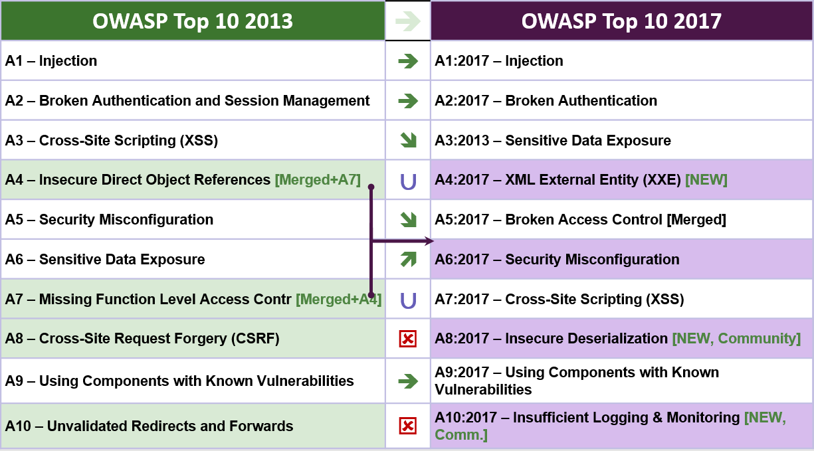

# RN Notas sobre la versión
## ¿Que ha cambiado de 2013 a 2017?

Los cambios se han acelerado en los últimos cuatro años, y OWASP Top 10 necesitaba actualizarse. Hemos rediseñado completamente a OWASP Top 10, mejorado la metodología, utilizado un nuevo proceso de pedido de datos, trabajamos con la comunidad, reordenamos los riesgos, reescribimos cada uno de los riesgos desde cero, y agregamos referencias a marcos de trabajo y lenguajes que son utilizados actualmente

En la última década, y en particular estos últimos años más cercanos, la arquitectura fundamental de las aplicaciones ha cambiado en forma significativa:
*JavaScript es actualmente el lenguaje más utilizado en la web. Node.js y marcos de trabajo modernos como Boostrap, Electron, Angular, React entre otros, significa que código que antes residía en los servidores ahora ejecuta en los navegadores, cuyo ambiente no es de confianza.
*Aplicaciones de página única, escritos en marcos de trabajo de JavaScript como Angular y React, permiten la creación de experiencias de usuarios altamente modulares, sin dejar de mencionar el crecimiento de las aplicaciones móviles que utilizan las mismas API que las aplicaciones de página única.
*Micro servicios escritos en node.js y Spring Boot están reemplazando aplicaciones de canales de servicios empresariales viejas que utilizaban tecnología EJB y otras similares. Código viejo que no se esperaba se comunicara directamente con Internet está ahora colocado directamente detrás de una API o un servicio web tipo RESTful. La asunciones en este código, como la confianza en los clientes, simplemente ya no son más válidas.

**Nuevos riesgos, determinados por datos recibidos **

* **A4:2017 - XML Entidad Externa (XXE)** es una nueva categoría, principalmente determinados por datos provistos por Análisis de seguridad estáticos. 

**Nuevos riesgos, determinados por la comunidad**

Solicitamos a la comunidad que nos enviara datos sobre las categorías de riesgos con proyección a futuro.
Se recibieron 516 respuestas y de luego de quitar aquellas categorías ya determinadas por datos (como Exposición de Datos Sensitivos y XXE), las dos nuevas categorías de riesgos son:
* **A8:2017 – Deserialización Insegura**, responsable de una de las peores sustracciones de datos de todos los tiempos, y 
* **A10:2017 – Registro y Monitoreo Insuficiente **, la falta de estos aspectos pueden prevenir y demorar en forma significativa la detección de actividad maliciosa o de la sustracción de datos, la respuesta a los incidentes y la investigación forense digital.

**Retirados, pero no olvidados**

* **A4 Referencia Directa Insegura a Objetos** and **A7 Ausencia de Control de Acceso a las Funciones** fue combinado con A5:2017-Control de Acceso mal configurado.
* **A8 CSRF**. Menos del 5% de los datos recibidos representan vulnerabilidades de este tipo, lo que ubica a CSRF alrededor de la posición #13 en la lista.
* **A10 Redirecciones y reenvíos no validados**. Menos del 1% de los datos recibidos representan vulnerabilidades de este tipo, por lo que pasó a ocupar el puesto #25.

